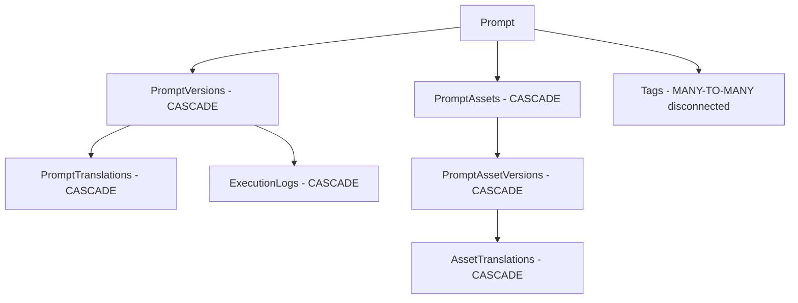

# Sistema de Backup de Prompts - JAPM

## Descripción General

El sistema de backup de prompts de JAPM proporciona una solución completa para preservar todos los datos relacionados con un prompt antes de su eliminación. Esto incluye metadatos, versiones, traducciones, assets, logs de ejecución y estadísticas de uso.

## Problema Resuelto

Cuando se elimina un prompt en JAPM, se pierden automáticamente todos los datos relacionados debido a las relaciones en cascada:



### Datos que se preservan en el backup:

- **Metadata del prompt**: Nombre, descripción, tipo, fechas
- **Historial completo**: Todas las versiones y cambios
- **Traducciones**: Todo el contenido multiidioma
- **Assets**: Archivos, documentos vinculados con sus versiones
- **Logs de ejecución**: Historial de uso y resultados
- **Estadísticas**: Métricas de uso y análisis

## Configuración

### Variables de entorno:

```env
# Directorio donde se guardan los backups
PROMPT_BACKUP_DIR=/var/lib/japm/prompt-backups

# Si guardar backups en archivo (true por defecto)
PROMPT_BACKUP_SAVE_TO_FILE=true
```

### Configuración del módulo:

```typescript
// En app.module.ts
import { CommonModule } from './common/common.module';

@Module({
  imports: [
    // ... otros módulos
    CommonModule,
  ],
})
export class AppModule {}
```

## Uso del Sistema

### 1. Backup Automático en Eliminación

Cuando se elimina un prompt, se crea automáticamente un backup completo:

```typescript
// Controller
@Delete(':id')
async remove(
  @Param('projectId') projectId: string,
  @Param('id') id: string,
  @Request() req: AuthenticatedRequest,
  @Query('deletionReason') deletionReason?: string,
  @Query('includeExecutionLogs') includeExecutionLogs?: string,
  @Query('executionLogsLimit') executionLogsLimit?: string,
): Promise<void> {
  const backupOptions = {
    deletionReason,
    includeExecutionLogs: includeExecutionLogs === 'true',
    executionLogsLimit: executionLogsLimit ? parseInt(executionLogsLimit, 10) : undefined,
  };

  return this.promptService.remove(id, projectId, userId, tenantId, backupOptions);
}
```

### 2. Backup Manual

Crear un backup sin eliminar el prompt:

```http
POST /projects/{projectId}/prompts/{promptId}/backup
Content-Type: application/json
Authorization: Bearer {token}

{
  "deletionReason": "Backup before major update",
  "includeExecutionLogs": true,
  "executionLogsLimit": 100
}
```

### 3. Listar Backups

Ver todos los backups disponibles:

```http
GET /projects/{projectId}/prompts/backups/list
Authorization: Bearer {token}
```

Respuesta:
```json
{
  "backups": [
    {
      "fileName": "prompt-backup-my-prompt-2024-01-15T10-30-00-000Z.json",
      "filePath": "/var/lib/japm/prompt-backups/prompt-backup-my-prompt-2024-01-15T10-30-00-000Z.json",
      "size": 1048576,
      "createdAt": "2024-01-15T10:30:00.000Z",
      "promptId": "my-prompt",
      "promptName": "My Important Prompt"
    }
  ],
  "totalBackups": 1,
  "totalSize": 1048576
}
```

## Estructura del Backup

Un archivo de backup contiene toda la información del prompt:

```json
{
  "backupMetadata": {
    "timestamp": "2024-01-15T10:30:00.000Z",
    "backupVersion": "1.0",
    "deletionReason": "Manual deletion",
    "deletedBy": "user-123",
    "tenantId": "tenant-abc",
    "projectId": "project-xyz"
  },
  "prompt": {
    "id": "my-prompt",
    "name": "My Important Prompt",
    "description": "A critical business prompt",
    "type": "USER",
    "projectId": "project-xyz",
    "tenantId": "tenant-abc",
    "createdAt": "2024-01-01T00:00:00.000Z",
    "updatedAt": "2024-01-15T09:00:00.000Z"
  },
  "versions": [
    {
      "id": "version-123",
      "promptText": "You are a helpful assistant...",
      "languageCode": "en-US",
      "versionTag": "2.1.0",
      "changeMessage": "Updated for better accuracy",
      "status": "active",
      "createdAt": "2024-01-15T09:00:00.000Z",
      "updatedAt": "2024-01-15T09:00:00.000Z",
      "translations": [
        {
          "id": "trans-456",
          "languageCode": "es-ES",
          "promptText": "Eres un asistente útil...",
          "createdAt": "2024-01-15T09:30:00.000Z",
          "updatedAt": "2024-01-15T09:30:00.000Z"
        }
      ],
      "activeInEnvironments": [
        {
          "id": "env-prod",
          "name": "Production"
        }
      ]
    }
  ],
  "assets": [
    {
      "id": "asset-789",
      "key": "company-logo",
      "enabled": true,
      "createdAt": "2024-01-01T00:00:00.000Z",
      "updatedAt": "2024-01-10T00:00:00.000Z",
      "versions": [
        {
          "id": "asset-version-101",
          "value": "https://example.com/logo.png",
          "versionTag": "1.0.0",
          "status": "active",
          "translations": [
            {
              "id": "asset-trans-202",
              "languageCode": "es-ES",
              "value": "https://example.com/logo-es.png",
              "createdAt": "2024-01-10T00:00:00.000Z",
              "updatedAt": "2024-01-10T00:00:00.000Z"
            }
          ]
        }
      ]
    }
  ],
  "tags": [
    {
      "id": "tag-303",
      "name": "customer-service",
      "description": "Customer service related prompts"
    }
  ],
  "executionLogs": [
    {
      "id": "exec-404",
      "timestamp": "2024-01-15T08:00:00.000Z",
      "promptVersionId": "version-123",
      "input": "How can I help you today?",
      "output": "I'm here to assist you with any questions...",
      "success": true,
      "durationMs": 1500
    }
  ],
  "statistics": {
    "totalVersions": 5,
    "totalTranslations": 12,
    "totalAssets": 3,
    "totalAssetVersions": 8,
    "totalAssetTranslations": 6,
    "totalExecutions": 1250,
    "lastExecutionDate": "2024-01-15T08:00:00.000Z",
    "mostUsedLanguages": [
      {
        "languageCode": "en-US",
        "count": 800
      },
      {
        "languageCode": "es-ES",
        "count": 450
      }
    ]
  }
}
```

## Gestión de Backups

### Ubicación de archivos

Los backups se guardan en el directorio configurado (por defecto: `storage/prompt-backups/`):

```
storage/
└── prompt-backups/
    ├── prompt-backup-my-prompt-2024-01-15T10-30-00-000Z.json
    ├── prompt-backup-another-prompt-2024-01-14T15-45-30-000Z.json
    └── ...
```

### Nomenclatura de archivos

Los archivos siguen el patrón:
```
prompt-backup-{prompt-id}-{timestamp}.json
```

Donde:
- `{prompt-id}`: ID del prompt (slug)
- `{timestamp}`: Fecha/hora en formato ISO sin caracteres especiales

### Limpieza automática

**Nota**: La limpieza automática de backups antiguos no está implementada. Se recomienda configurar:

1. **Rotación manual**: Script para eliminar backups más antiguos de X días
2. **Compresión**: Comprimir backups antiguos para ahorrar espacio
3. **Archivo externo**: Mover backups antiguos a almacenamiento de archivo

Ejemplo de script de limpieza:

```bash
#!/bin/bash
# Eliminar backups más antiguos de 90 días
find /var/lib/japm/prompt-backups -name "prompt-backup-*.json" -mtime +90 -delete

# Comprimir backups más antiguos de 30 días
find /var/lib/japm/prompt-backups -name "prompt-backup-*.json" -mtime +30 -not -name "*.gz" -exec gzip {} \;
```

## Integración con Audit Logging

El sistema de backup se integra con el sistema de auditoría:

```typescript
// Información del backup se incluye en los logs de auditoría
const promptDataForAudit = {
  id: prompt.id,
  name: prompt.name,
  // ... otros datos
  backupCreated: !!backupInfo,
  backupPath: backupInfo?.backupPath,
  backupSize: backupInfo ? JSON.stringify(backupInfo.backupData).length : 0,
  deletionReason: backupOptions?.deletionReason,
};

this.auditLogger.logDeletion(
  auditContext,
  'Prompt',
  id,
  prompt.name,
  promptDataForAudit,
);
```

## Casos de Uso

### 1. Eliminación accidental

Cuando se elimina un prompt por error, el backup permite recuperar toda la información:

1. **Localizar el backup**: Usar la API de listado o buscar en el filesystem
2. **Revisar contenido**: Examinar el JSON del backup
3. **Recrear prompt**: Usar la API de `load-structure` con los datos del backup

### 2. Auditoría de cambios

Los backups proporcionan un historial completo de la evolución de prompts críticos:

1. **Comparar versiones**: Analizar diferencias entre backups
2. **Análisis de uso**: Revisar estadísticas y logs de ejecución
3. **Compliance**: Demostrar que se mantienen registros completos

### 3. Migración de datos

Los backups facilitan la migración entre entornos:

1. **Exportar prompts**: Crear backups de prompts importantes
2. **Transferir archivos**: Mover los JSON de backup
3. **Importar en destino**: Usar `load-structure` para recrear

### 4. Desarrollo y testing

Usar backups para crear entornos de prueba:

1. **Backup de producción**: Crear snapshot de prompts productivos
2. **Restaurar en desarrollo**: Recrear el entorno exacto
3. **Pruebas seguras**: Experimentar sin afectar producción

## Consideraciones de Performance

### Tamaño de backups

El tamaño del backup depende de:
- **Número de versiones**: Más versiones = mayor tamaño
- **Traducciones**: Cada idioma multiplica el contenido
- **Assets**: Especialmente si contienen datos grandes
- **Logs de ejecución**: Pueden ser muy voluminosos

### Recomendaciones

1. **Limitar logs**: Usar `executionLogsLimit` para controlar el tamaño
2. **Backup selectivo**: No incluir logs para backups rutinarios
3. **Compresión**: Comprimir archivos de backup grandes
4. **Almacenamiento externo**: Usar S3 u otro servicio para backups grandes

## Seguridad

### Contenido sensible

Los backups pueden contener información sensible:
- **Prompts de negocio**: Lógica empresarial crítica
- **Datos de entrada**: Logs con información personal
- **APIs keys**: Referencias a servicios externos

### Medidas de seguridad

1. **Permisos de archivo**: Restringir acceso al directorio de backups
2. **Encriptación**: Encriptar backups en reposo
3. **Rotación**: Eliminar backups antiguos regularmente
4. **Audit trail**: Registrar quién accede a los backups

## Futuras Mejoras

### Funcionalidades pendientes

1. **Restauración automática**: Endpoint para restaurar desde backup
2. **Backup incremental**: Solo cambios desde último backup
3. **Compresión automática**: Comprimir backups grandes
4. **Almacenamiento externo**: Integración con S3, Azure Blob, etc.
5. **Búsqueda avanzada**: Buscar en contenido de backups
6. **Backup programado**: Crear backups automáticos periódicos

### Ejemplo de restauración (futuro):

```http
POST /projects/{projectId}/prompts/restore
Content-Type: application/json
Authorization: Bearer {token}

{
  "backupPath": "/path/to/backup.json",
  "options": {
    "overwriteExisting": false,
    "restoreExecutionLogs": false
  }
}
```

## Conclusión

El sistema de backup de prompts proporciona una red de seguridad esencial para proteger datos críticos en JAPM. Con backups automáticos, opciones flexibles y integración completa con el sistema de auditoría, garantiza que nunca se pierda información valiosa durante las operaciones de eliminación.

La implementación actual cubre los casos de uso más importantes, con un diseño extensible que permite futuras mejoras y optimizaciones según las necesidades del negocio. 